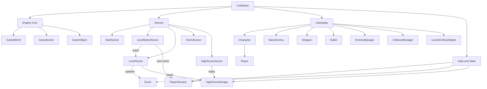
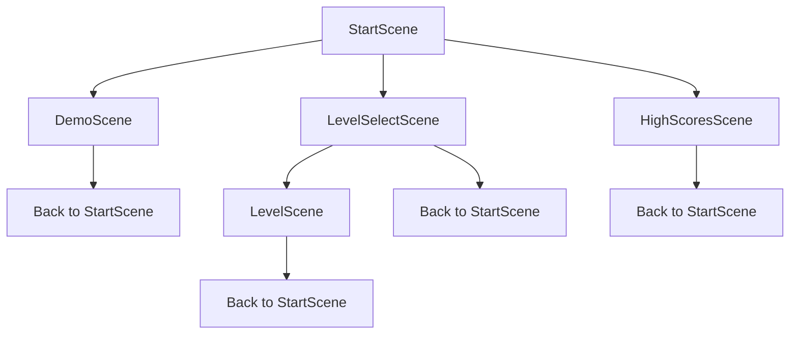

# Codebase Tree Diagram (High-Level)

This tree shows the core architecture and scene/gameplay relationships in a top-down format.

## Scene Tree (UI Navigation)

## Notes

- This version is tree-first for quick understanding.
- If you want, I can also add a separate detailed tree only for `LevelScene` combat systems.

## Module Files

- Engine Core: `docs/modules/engine-core.md`
- Scenes: `docs/modules/scenes.md`
- Gameplay: `docs/modules/gameplay.md`
- Data and State: `docs/modules/data-state.md`
- Index: `docs/modules/README.md`

