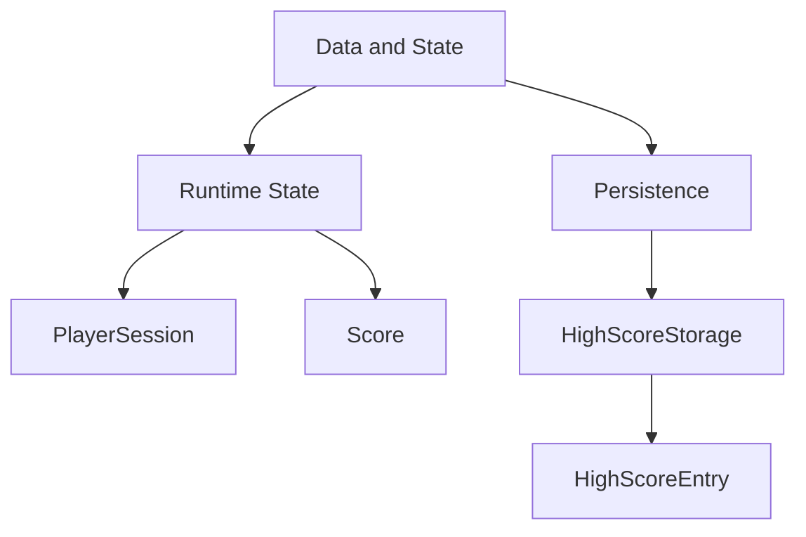

# Data and State Module

## Tree Diagram

## Usages

- `PlayerSession` stores current player name set in `LevelSelectScene`.
- `Score` is updated each frame in `LevelScene`.
- `HighScoreStorage` persists leaderboard entries when game over occurs.
- `HighScoresScene` reads top entries from `HighScoreStorage` for UI rendering.
- `LevelScene` writes score snapshots to `HighScoreStorage` with timestamp metadata.

