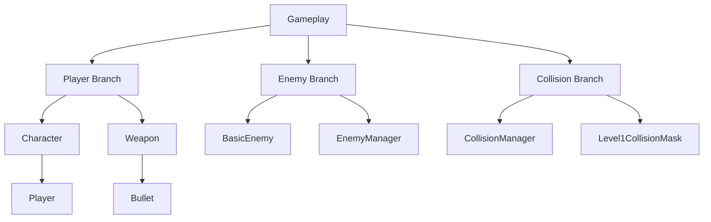

# Gameplay Module

## Tree Diagram

## Usages

- `LevelScene` creates and updates `Player`, `Weapon`, `BasicEnemy`, and `EnemyManager`.
- `Weapon` spawns `Bullet` objects during firing logic.
- `CollisionManager` processes contact between concrete, damaging, and damageable entities.
- `Level1CollisionMask` is used by player walkability checks.
- Enemy behavior and respawn coordination are delegated to `EnemyManager`.

