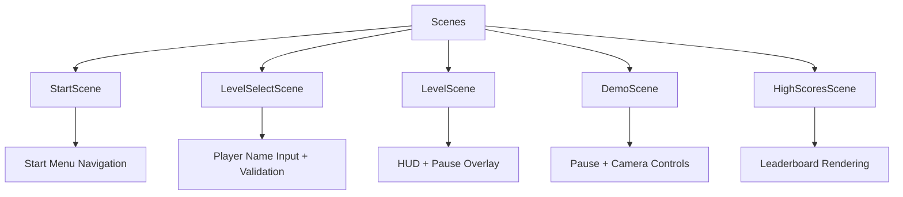
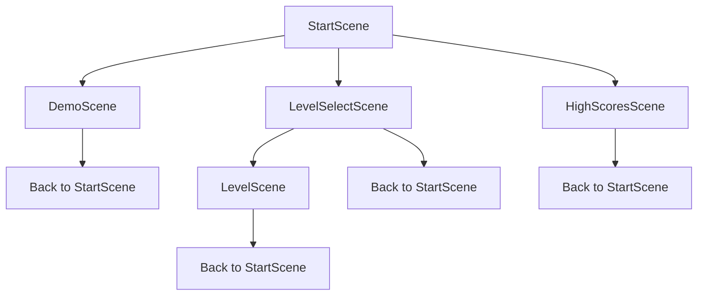

# Scenes Module

## Tree Diagram

## Usages

- `StartScene` is the main entry point and routes to gameplay, level select, and highscores.
- `LevelSelectScene` sets player name via `PlayerSession` and opens `LevelScene`.
- `LevelScene` handles core gameplay, camera tracking, score saving, and pause/game-over overlays.
- `DemoScene` acts as a sandbox scene with movement and camera controls.
- `HighScoresScene` reads score data from `HighScoreStorage` and renders leaderboard rows.

## Scene Navigation Tree

